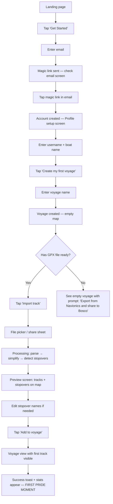
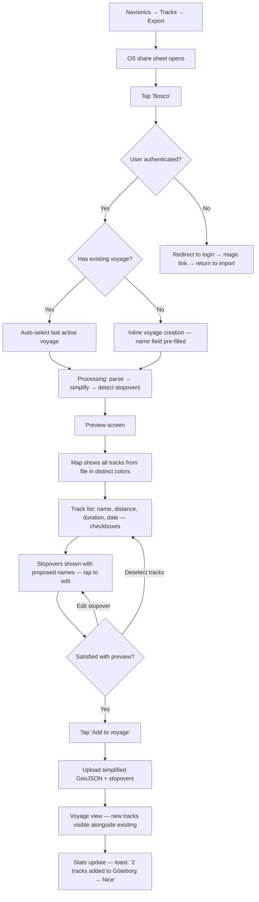
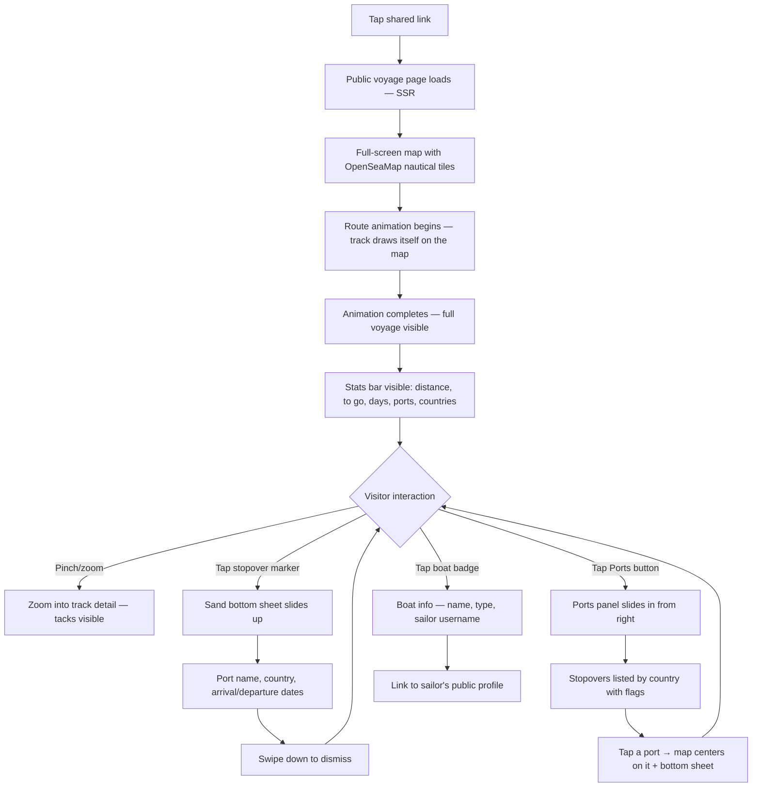
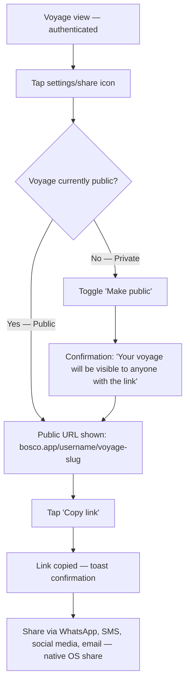
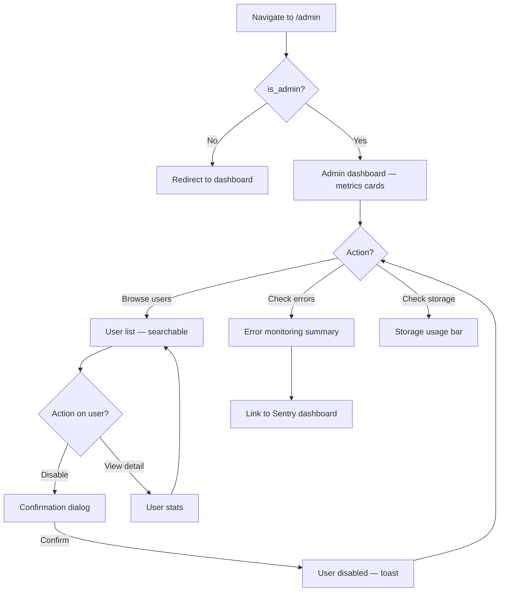
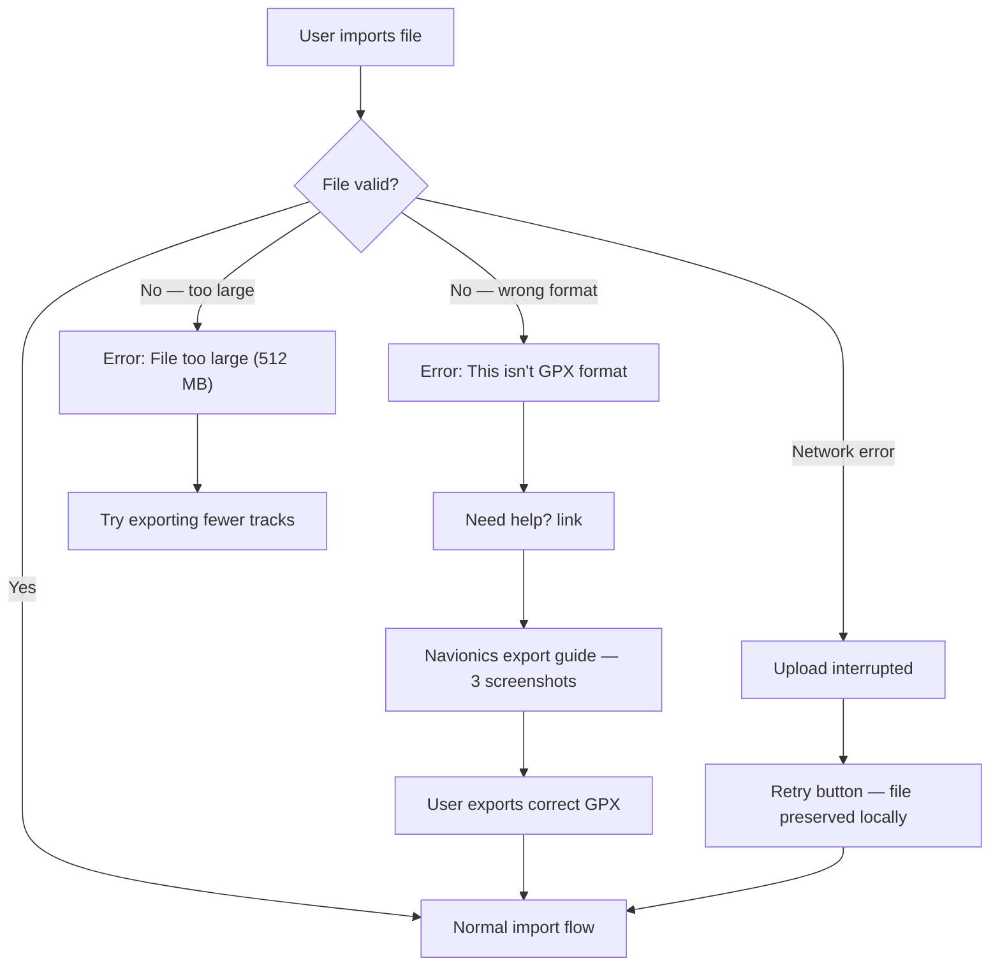
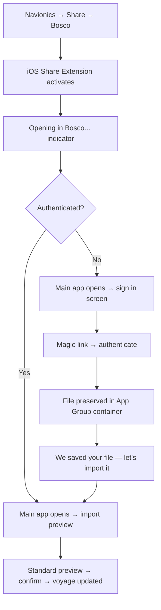

# UX Design Specification Bosco

**Author:** Seb
**Date:** 2026-03-15
**v1.0 Addendum:** 2026-03-29

---

## Executive Summary

### Project Vision

Bosco transforms raw Navionics GPS tracks into a shareable visual voyage narrative. Where existing solutions (blogs, social media, navigation apps) connect dots on a map, Bosco preserves the exact sailing track — every tack, every close-hauled beat, every mile sailed. The squiggly line beating upwind tells a story that pins on a map never will.

The product was born from a real need: Seb, sailing from Göteborg to Nice on his Laurin Koster 28 "Laurine", is constantly asked by friends and family — "where did you go?". The existing prototype (sebastientreille.fr) proved the concept's value with strong visitor engagement and personal satisfaction as a voyage keepsake — for the skipper and for crew members alike.

The goal is to make this experience available to any recreational sailor.

### Target Users

**Primary — The long-distance cruiser**
- Multi-month, multi-country voyages (deliveries, Mediterranean tours, Atlantic crossings)
- Uses Navionics as primary navigation app
- Imports tracks at port on smartphone, sometimes after several days at sea
- Wants to share the voyage with family, friends, and former crew members
- Tech level: comfortable with a smartphone, not necessarily technical
- Motivation: the memory, the sharing, the pride of the path sailed

**Secondary — The weekend sailor**
- Regular outings (weekends, holidays) from a home port
- Accumulates tracks over a sailing season
- Less urgency to share, more about personal archiving

**Audience — The visitor (family, friends, community)**
- Receives a link, discovers the voyage on phone or desktop
- May not know sailing — the experience must be understandable without nautical context
- Wants to explore the map, see the stats, read the journal

### Key Design Challenges

1. **Mobile-first GPX import** — The entire chain (Navionics export → file selection → preview → confirmation) must work without friction on smartphone, in port conditions (fatigue, variable connectivity). This is THE critical flow.

2. **Map as primary UI on mobile** — The map is the star of the product, but mobile screens are small. Controls, stats, stopover panel, and journal must layer over the map without cluttering or suffocating the visual experience.

3. **Client-side processing of massive files** — Raw GPX files (up to 400 MB) are parsed, simplified (Douglas-Peucker), and converted to lightweight GeoJSON in the browser before any server upload. Only the simplified result (a few KB-MB) is sent to the server. The UX must communicate this processing progression (parsing → simplification → preview) and remain responsive, especially on mobile.

4. **Progressive voyage building** — The voyage is built over months, with episodic imports. The UX must make it trivial to add new tracks to an existing voyage — open, import, done.

### Design Opportunities

1. **Track animation** — Already validated by the prototype, this is the "wow" moment. When a visitor opens a shared link and watches the route draw itself on the map, the emotional impact is immediate. This is the viral hook.

2. **Zoom storytelling** — At macro scale, the entire voyage is visible (Göteborg → Nice). Zoom in and discover the tacks, the close-hauled beats, the detours — this is Bosco's unique differentiator against any travel blog or waypoint-based tracker.

3. **Import-to-share in 3 gestures** — If we nail the flow (import GPX → auto-detected stopovers → share link), we reach the magic moment Seb describes. Arrive at port, 2 minutes, the voyage is updated and shared.

## Core User Experience

### Defining Experience

Bosco has two distinct experience loops:

**Creator loop (daily, at port):**
Export from Navionics → tap "Bosco" in Android share sheet → see preview → confirm → track appears on the voyage map → done. This is the core loop. It must take under 2 minutes, start to finish, on a smartphone.

**Visitor loop (on-demand, from shared link):**
Open link → watch the route animate on the map → explore by zooming and panning → tap stopovers for port names and dates → browse stats. Read-only, no account needed. Works on any browser, any device.

The creator loop drives content creation. The visitor loop drives sharing and engagement. Both are map-centric.

### Platform Strategy

**Web (responsive, SSR):**
- Public voyage pages: standard responsive web, SSR, accessible on any browser and device (iOS Safari, Android Chrome, desktop browsers)
- Creator experience: responsive web accessible via any modern browser
- PWA capabilities: Web Share Target on Android, installable on home screen

**Native Apps — Capacitor (v1.0):**
- iOS and Android apps wrapping `sailbosco.com` via Capacitor WebView shell
- iOS Share Extension (Swift) — receives GPX files from Navionics share sheet
- Android Intent filter — receives GPX files from Navionics share sheet
- Native share sheet for sending links (`@capacitor/share`)
- Deep linking: Universal Links (iOS) + App Links (Android) via `.well-known/`
- Available on Apple App Store and Google Play Store
- Single codebase: what works on web works in the app

**Non-negotiable:** The ability to export directly from Navionics into Bosco via the share sheet is THE core flow on **both iOS and Android**. The entire platform strategy serves this requirement.

### Effortless Interactions

**Must be effortless (zero friction):**
- Onboarding: email magic link → username + boat name → create first voyage → import first track. Four steps, and the sailor has everything needed for a public profile and shareable URLs.
- Adding a track to an existing voyage: open voyage → import → done. No re-configuration, no re-setup.
- Sharing: toggle public → copy link. One gesture.

**Must be automatic (zero user effort):**
- Stopover detection from leg endpoints
- Port naming via reverse geocoding
- Stats computation (distance, duration, speed, ports count, countries count)
- Leg connection — matching leg endpoints to existing stopovers within radius
- Track simplification during import — transparent to the user beyond a progress indicator

**Implemented (Epic 4 — Journal & Photos):**
- Log entries (journal) — users can create journal entries with free-form text and photo attachments, linked to dates, legs, and stopovers. Journal timeline visible on both creator and public voyage pages. Photo lightbox for full-screen viewing. "Add a note" link in StopoverSheet invites entries without being pushy.

### Critical Success Moments

1. **First import via share sheet** — The sailor exports from Navionics, taps Bosco in the share sheet, sees the preview, confirms. If this flow works end-to-end on Android, the product delivers its core promise.

2. **The zoom-in revelation** — A visitor (or the sailor themselves) zooms into a segment and sees the tacks, the close-hauled beats, the exact path sailed. This is the moment they understand what makes Bosco different. No other tool shows this.

3. **The share moment** — The sailor copies the public link and sends it to family or friends. The recipient opens it and immediately sees a beautiful animated route on a responsive page that works everywhere. No app install, no sign-up, no friction.

4. **The returning import** — The sailor returns to port days or weeks later, opens Bosco, and adds new tracks to the same voyage. The new legs connect seamlessly to the existing route. The voyage grows effortlessly over time.

5. **The voyage takes shape** — After 3-4 imports, the stopovers have auto-connected, the stats have accumulated, and the sailor sees their journey forming on the map. This is the long-term engagement moment — the one that turns a curious user into a loyal one, import after import.

### Experience Principles

1. **Map first, everything else second** — The map is the product. Every UI decision serves the map. Controls overlay, never compete. Stats inform, never distract.

2. **Import is king** — The GPX import flow via the share sheet is the most important interaction in the product. It must be fast, reliable, and require minimal decisions. Everything that can be automated (stopovers, stats, connections) is automated.

3. **Progressive disclosure** — Show the essential (map, track, stats) immediately. Reveal detail on demand (stopover info on tap, journal entries on scroll). Never overwhelm with options.

4. **Zero configuration** — Sensible defaults everywhere. Simplification tolerance, stopover radius, track merging — these work out of the box. Power users can tweak later, but the default path requires no decisions.

## Desired Emotional Response

### Primary Emotional Goals

**For the sailor (creator):**
- **Pride** — "Look at the path I sailed." The track on the map is tangible proof of a personal achievement. Sharing it amplifies this feeling.
- **Nostalgia** — Revisiting the voyage, the stopovers, the legs where the wind was tough. A beautiful memory to come back to.
- **Joy of sharing** — The happiness of sending the link to family, friends, and former crew members — and seeing them reshare it on social media.

**For the crew (co-creators):**
- **Shared memory** — Seeing the exact places where they struggled together, the paths they took, the stopovers they made. Not a feature — a feeling. The track is their shared story.

**For the visitor (consumer):**
- **Wonder** — The animated route drawing itself, the sheer scale of the journey. "Wow, that's beautiful."
- **Curiosity** — Zooming in to see the detail, the tacks, the choices. Sailor friends find it technically fascinating. Non-sailors find it visually captivating.
- **Connection** — Feeling closer to the sailor's journey, understanding where they went and what it took.

### Emotional Journey Mapping

| Stage | Sailor (creator) | Visitor |
|-------|------------------|---------|
| Discovery / First visit | Excitement — "This is exactly what I need" | Intrigue — "What is this?" |
| Onboarding | Confidence — fast, simple, no barriers | N/A |
| First import | Relief + satisfaction — "It just works" | N/A |
| Viewing the map | Pride — "That's my journey" | Wonder — "That's beautiful" |
| Zooming in | Nostalgia — reliving the moments | Curiosity — exploring the detail |
| Sharing the link | Joy — extending the experience to others | N/A |
| Receiving the link | N/A | Curiosity — "Let me see" |
| Returning to import more | Anticipation — the voyage grows | N/A |
| Something goes wrong | Must feel: "I can fix this easily", never: "I lost my data" | Must feel: "Let me try again", never: "This is broken" |

### Micro-Emotions

**Critical to achieve:**
- Confidence over confusion — every step must feel obvious, especially during import
- Accomplishment over frustration — the track appears, the stats update, the voyage grows
- Trust over skepticism — the sailor trusts that simplification preserves their track's story

**Critical to avoid:**
- Anxiety during large file processing — clear progress indication, never a frozen screen
- Loss aversion — the sailor must never fear losing imported data
- Overwhelm — the map and controls must breathe, never feel cluttered

### Design Implications

- **Pride** → The public voyage page must be visually stunning and share-worthy. It represents the sailor. If it looks amateur, it undermines the pride.
- **Wonder** → The track animation on first load must be smooth, well-paced, and cinematic. This is the first impression for every visitor.
- **Nostalgia** → Stopovers with names and dates anchor the memory. Tapping a stopover should feel like opening a chapter of the journey.
- **Confidence** → The import flow must provide clear feedback at every stage (parsing, simplifying, previewing). No ambiguous loading spinners.
- **Trust** → The simplified track must visually match the original at the zoom level that matters (tacks visible). If simplification strips too much, trust breaks.
- **Shared memory** → The public page URL must be easy to copy, text, and reshare. Social media previews (Open Graph) must show the map and voyage name — making crew members proud to reshare.

### Emotional Design Principles

1. **The track is sacred** — It represents real miles sailed, real wind fought, real choices made. Every design decision must honor the track's fidelity and the story it tells.

2. **Beauty earns sharing** — People reshare things that make them look good. The public page must be beautiful enough that sailors and crew are proud to post it on social media.

3. **Calm confidence** — The app must never create anxiety. Clear feedback, obvious next steps, no data loss fears. The sailor just got off the water — the last thing they need is a stressful app.

4. **Delight in detail** — The zoom-in moment is where Bosco shines. The more the user explores, the more they discover. Reward curiosity with sailing detail.

## UX Pattern Analysis & Inspiration

### Inspiring Products Analysis

**Google Maps — The map interaction standard**
Maps sets the baseline interaction model that all Bosco users already know: pinch-to-zoom, pan, tap for detail. The bottom sheet pattern (tap a marker → detail panel slides up from bottom) is the most natural way to layer information over a map on mobile. Bosco should feel as natural as Maps.

**Navily — Sailing-native UX vocabulary**
Navily proves that a map-centric app designed specifically for sailors works. Port markers, anchorage details, community reviews — the visual language speaks directly to Bosco's target users. The lesson: use nautical visual cues (anchor icons, port markers) that sailors recognize instantly.

**PolarSteps — The gap Bosco fills**
PolarSteps nails the travel journal and social sharing experience, but it does not show precise GPS tracks. It connects dots between locations. Bosco's differentiator is exactly what PolarSteps lacks: the actual sailing path with every tack visible. PolarSteps is the anti-reference for track precision, but a valid reference for timeline design and sharing mechanics.

**TravelBoast — The viral animation model**
TravelBoast generates animated route videos for social media — the same emotional hook as Bosco's track animation, but as a shareable video rather than a live interactive map. This validates that animated route visualization triggers sharing behavior. Bosco's advantage: the animation lives on a web page that anyone can explore further by zooming and tapping, rather than a static video.

**NoForeignLand — The community vision**
NoForeignLand shows the community potential for V2: shared voyages, crew connections, port knowledge. For MVP, the lesson is simpler: the public page structure (voyage + stopovers + stats) is proven to engage sailing audiences.

### Transferable UX Patterns

**Navigation patterns:**
- **Google Maps bottom sheet** → Use for stopover details on tap. Panel slides up from bottom, map stays visible behind. Familiar to every smartphone user.
- **Map-as-canvas with floating controls** → Stats bar at bottom, boat name at top-left, ports panel accessible via button at top-right. Proven in Bosco's prototype, consistent with Maps conventions.

**Interaction patterns:**
- **Share sheet as import trigger** (Android OS pattern) → Navionics export → Bosco appears in share targets. No custom import flow needed — leverage the OS.
- **Achievement badges as stats** → The stats bar (distance, ports, countries) functions like achievement badges in gaming. They reward the sailor and give visitors a quick read on the voyage's scale. Keep these prominent and always visible.

**Visual patterns:**
- **Full-bleed map with OpenSeaMap nautical overlay** → Leaflet with OpenStreetMap base tiles + OpenSeaMap layer on top. At closer zoom levels, buoys (cardinal, lateral), lighthouses, channels, depth soundings, and anchorage zones become visible. This gives maritime context to the track — visitors can see the sailor navigated between buoys, followed the channel, chose a specific route for nautical reasons. Reinforces the product's sailing identity: we are sailors, not hikers.
- **Animated route drawing** → Validated by TravelBoast's success on social media and Bosco's prototype. The animation must be smooth and well-paced — cinematic, not rushed.

### Anti-Patterns to Avoid

- **PolarSteps' imprecise tracking** → Never simplify a track to the point where tacks disappear. The sailing detail IS the product. If a user zooms in and sees a straight line, trust is broken.
- **Feature overload on the map** → Orca and full chartplotters show everything. Bosco is not a navigation tool — it is a storytelling tool. Only show what serves the story: the track, the stopovers, the stats, and the nautical context (OpenSeaMap).
- **Mandatory journaling** → PolarSteps pushes users to add photos and text. For Bosco MVP, the journal is optional. Never block the core flow (import → share) with content creation pressure.
- **Cluttered mobile controls** → On a 6" screen, every pixel matters. Controls must be minimal, contextual, and dismissible. If it is not the map, the track, or the stats, it needs to justify its screen presence.

### Design Inspiration Strategy

**Adopt directly:**
- Google Maps bottom sheet for stopover detail panels
- Full-bleed map as primary canvas with floating overlays
- OpenSeaMap nautical tile layer for maritime context (buoys, lighthouses, channels, soundings)
- Stats bar as permanent achievement display (from prototype)
- Share sheet integration as primary import method

**Adapt for Bosco:**
- TravelBoast's animation concept → interactive web version rather than static video, with user-controlled playback pace
- PolarSteps' social sharing flow → simplified to toggle public + copy link, no complex sharing wizard
- Navily's nautical visual language → subtle sailing cues (anchor icons for stopovers, boat icon for current position) without chartplotter complexity

**Avoid:**
- Chartplotter-level data density — Bosco tells stories, not navigation data
- Mandatory content creation workflows — import is king, everything else is optional
- Imprecise track rendering — the squiggly line is sacred
- Generic map tiles without nautical context — OpenSeaMap is non-negotiable for sailing identity

## Design System Foundation

### Design System Choice

Dual approach matching the two distinct experiences:

**Creator experience (PWA, authenticated):** shadcn/ui + Tailwind CSS
**Public visitor experience:** Custom components in Tailwind CSS

### Rationale for Selection

**shadcn/ui for the creator side:**
- Solo developer needs speed on standard UI components (forms, buttons, modals, toasts, dropdowns)
- Copy-paste model — code lives in the project, fully customizable, no external dependency lock-in
- Built on Radix UI — accessible by default (WCAG 2.1 AA alignment)
- Native integration with Next.js 15 and Tailwind CSS — zero friction with the existing stack
- Only import what is needed — no bloat from unused components

**Custom Tailwind for the public side:**
- The public voyage page is the product's showcase — it must have its own visual identity
- Very few traditional UI components needed — mostly Leaflet map + floating overlays + stats bar
- Custom components allow pixel-perfect control over the share-worthy experience
- The map, animation, and nautical overlay (OpenSeaMap) are inherently custom — the surrounding UI should match

### Implementation Approach

**Shared foundation:**
- Tailwind CSS configuration (colors, typography, spacing) shared across both experiences
- Design tokens defined once in `tailwind.config.ts` for consistency
- Common utilities (formatters, icons) reused across both sides

**Creator components (shadcn/ui):**
- Install only needed components: Button, Input, Dialog, Toast, DropdownMenu, Card, Form
- Customize theme to match Bosco's visual identity via Tailwind config
- Standard Next.js App Router patterns for pages and layouts

**Public components (custom):**
- MapCanvas — full-bleed Leaflet wrapper with OpenSeaMap layer
- StatsBar — floating achievement display (distance, ports, countries)
- StopoverSheet — Google Maps-style bottom sheet on marker tap
- BoatCard — top-left boat name and type overlay
- PortsPanel — collapsible right-side panel for stopovers list
- RouteAnimation — track drawing animation controller

### Customization Strategy

- **Color palette:** Nautical-inspired but not cliché. Deep blues, clean whites, subtle warm accents. Defined as Tailwind design tokens.
- **Typography:** Clean, modern sans-serif. Readable at small sizes on mobile for stats and stopover names. One font family to keep bundle size minimal.
- **Spacing and layout:** Generous spacing on the public page (the map breathes). Tighter, functional spacing on the creator side (dashboard efficiency).
- **Dark mode:** Not for MVP. The map tiles (OpenStreetMap + OpenSeaMap) are light, and a dark mode would require alternative tile sources.

## Defining Core Interaction

### Defining Experience

**Bosco in one sentence:** "Export your GPS track from Navionics, see your exact sailing path on a shareable map."

This is a combination of an established OS pattern (share sheet) with a novel outcome (instant sailing voyage visualization). The user does something familiar (share a file) and gets something they've never had before (their precise track on a nautical map with auto-detected stopovers).

### User Mental Model

**What sailors already know:**
- They export tracks from Navionics regularly (to save, to share with crew, to analyze)
- The share sheet is a familiar OS-level pattern — they use it for photos, PDFs, links
- They expect exported data to "go somewhere" and be usable

**What's new with Bosco:**
- The file doesn't just get stored — it becomes a visual voyage on a map
- Stopovers are detected and named automatically — the sailor doesn't have to build the voyage manually
- The result is immediately shareable via a public URL

**Where confusion could occur:**
- Multi-track files: which tracks to import? The preview must make this clear.
- Auto-detected stopover names may be wrong (reverse geocoding returns "Quimper" instead of "Audierne") — the sailor can correct before or after import.
- Track simplification: the sailor might worry about losing detail — the preview must show the simplified track looks faithful.

### Success Criteria

| Criteria | Indicator |
|----------|-----------|
| Speed | Import flow completes in under 2 minutes on smartphone |
| Clarity | The sailor always knows what step they're on and what to do next |
| Accuracy | Auto-detected stopovers are correct or easily correctable |
| Trust | The simplified track preview shows visible tacks at zoom level 14 |
| Completion | After confirmation, the voyage map shows the new track immediately |
| Emotion | The sailor sees their full voyage with the new segment — pride moment |

### Novel UX Patterns

**Established patterns (no education needed):**
- Android share sheet as import trigger — users already know this
- Map interaction (pinch, pan, tap) — Google Maps muscle memory
- Bottom sheet for detail — universally understood on mobile
- Stats display — self-explanatory numbers

**Novel combination (Bosco's innovation):**
- Share sheet → instant voyage visualization is new. No other app turns a shared GPX file into a visual voyage story in real time.
- Auto-detected stopovers with editable names — the system proposes, the user validates. This is a collaborative pattern between automation and human knowledge (the sailor knows the port name better than the geocoder).

**No user education needed:** Every individual interaction is familiar. The innovation is in the chain: share → parse → simplify → preview → confirm → voyage updated.

### Experience Mechanics

**The Import Flow — Step by Step:**

**1. Initiation — Share from Navionics**
- Sailor opens Navionics → Tracks → selects tracks → Export → Share sheet opens
- Sailor taps "Bosco" in the share sheet
- Bosco PWA opens, receives the GPX file
- If a voyage exists: automatically targets the last active voyage
- If no voyage exists: inline voyage creation — name field pre-filled intelligently (e.g., from detected ports or date)

**2. Processing — Client-side, with progress feedback**
- Progress indicator: "Parsing tracks..." → "Simplifying..." → "Detecting stopovers..."
- Processing happens in the browser — only lightweight result will be uploaded
- Screen remains responsive throughout (no frozen UI)

**3. Preview — The decision screen**
- Full-screen map showing all detected tracks from the file, each in a distinct color
- For each track: name (from GPX), distance, duration, date
- Checkboxes to select which tracks to import (all selected by default)
- Auto-detected stopovers shown as markers on the map with proposed names
- Each stopover name is editable inline — tap to rename (e.g., "Quimper" → "Audierne")
- Editing stopovers is possible but never required — corrections can also be made later from the voyage view
- The simplified track is displayed — sailor can zoom in to verify tack fidelity

**4. Confirmation — One tap**
- "Add to voyage" button
- Upload simplified GeoJSON + stopover data to server
- Brief loading state: "Adding to your voyage..."

**5. Completion — Stay on voyage view**
- Navigate to the full voyage map with the new track visible
- The new segment appears on the map alongside existing tracks
- Stats update to reflect the new import (distance, ports, countries)
- Success toast: "2 tracks added to Göteborg → Nice"
- The sailor experiences the emotional moment — seeing their growing voyage on the nautical map

## Visual Design Foundation

### Color System

**Primary palette — Ocean & Sunset:**
- **Navy** (`#1B2D4F`) — Deep backgrounds, headers, primary text. The ocean at night.
- **Ocean** (`#2563EB`) — Track line on map, links, interactive elements. Water in motion.
- **Coral** (`#E8614D`) — Warm accents, CTAs, stopover markers. The sunset at anchorage.
- **Amber** (`#F59E0B`) — Highlights, badges, stars. The warmth of adventure.
- **Sand** (`#FDF6EC`) — Light backgrounds, cards. Warm sand, logbook paper.

**Neutral palette:**
- **Slate** (`#334155`) — Secondary text
- **Mist** (`#94A3B8`) — Tertiary text, borders
- **Foam** (`#F1F5F9`) — Section backgrounds, separators
- **White** (`#FFFFFF`) — Stats bar, map overlays

**Semantic colors:**
- Success: `#10B981` (sea green) — successful import, voyage public
- Warning: `#F59E0B` (amber) — attention, suggested correction
- Error: `#EF4444` — import error, problem
- Info: `#2563EB` (ocean) — information, tips

**Map-specific:**
- Track line: Ocean (`#2563EB`) at 0.85 opacity, 3px weight
- Track animation: same color, 4px weight during animation
- Stopover markers: Coral (`#E8614D`) — stands out from map and track
- Stats bar: White background with subtle shadow, Navy text

### Typography System

**Heading font — "DM Serif Display"**
- Serif with character, warm, elegant without being rigid
- Used for: voyage name, boat name, section titles
- Evokes the logbook, maritime writing, adventure
- Fallback: Georgia, serif

**Body font — "Nunito"**
- Rounded sans-serif, friendly, highly readable at small sizes
- Used for: stats, stopover names, navigation text, UI elements
- Casual without being childish, fun without sacrificing readability
- Fallback: system-ui, sans-serif

**Type scale (mobile-first):**

| Level | Size | Weight | Font | Usage |
|-------|------|--------|------|-------|
| Display | 32px | Bold | DM Serif Display | Voyage name on public page |
| H1 | 24px | Bold | DM Serif Display | Page titles |
| H2 | 20px | SemiBold | DM Serif Display | Section titles |
| H3 | 16px | SemiBold | Nunito | Subsection titles |
| Body | 14px | Regular | Nunito | Default text |
| Small | 12px | Medium | Nunito | Stats labels, metadata |
| Tiny | 10px | Medium | Nunito | Map annotations |

**Stats display (special treatment):**
- Numbers: Nunito Bold, 28px — prominent, achievement feel
- Labels: Nunito Medium, 10px uppercase with wide tracking — "SAILED", "PORTS", "COUNTRIES"

### Spacing & Layout Foundation

**Base unit:** 4px
**Spacing scale:** 4, 8, 12, 16, 24, 32, 48, 64, 96

**Layout principles:**
- **Public page:** The map IS the layout. Zero padding around it. Floating overlays with 16px margin from edges. Stats bar at bottom with 16px horizontal padding.
- **Creator pages (dashboard, settings):** 16px horizontal padding on mobile. Max-width 1200px centered on desktop. 24px gaps between cards.
- **Import flow:** Full-screen map preview. Bottom action area with 16px padding. Track list as scrollable overlay.

**Border radius:**
- Cards and panels: 12px — warm, friendly, not sharp
- Buttons: 8px — slightly rounded, approachable
- Stopover markers: full circle
- Stats bar: 16px — pill-shaped, floating feel

**Shadows:**
- Floating overlays on map: `0 2px 12px rgba(27, 45, 79, 0.15)` — subtle navy shadow
- Cards: `0 1px 4px rgba(27, 45, 79, 0.08)` — barely visible lift
- Bottom sheet: `0 -4px 20px rgba(27, 45, 79, 0.12)` — upward shadow

### Accessibility Considerations

- Navy on Sand: contrast ratio 11.2:1 (AAA) — primary text always readable
- Ocean on White: contrast ratio 4.6:1 (AA) — links and interactive elements pass
- Coral on White: contrast ratio 3.8:1 — used only for decorative elements and large markers, never for small text
- Stats numbers (Navy on White): 12.5:1 (AAA)
- All interactive elements minimum 44x44px touch target on mobile
- Focus indicators: 2px Ocean outline with 2px offset — visible on all backgrounds

## Design Direction Decision

### Design Directions Explored

Four visual directions were explored for the public voyage page, two dashboard variants, and two bottom sheet styles, all applying the Ocean & Sunset palette with DM Serif Display + Nunito typography. Interactive HTML showcase generated at `_bmad-output/planning-artifacts/ux-design-directions.html`.

### Chosen Direction

**Public voyage page:** Direction D — Immersive Minimal
- Translucent glass overlays with backdrop blur (navy at 75% opacity)
- Minimal boat badge top-left (pill-shaped, green dot + boat name)
- Floating action button for ports panel access
- Translucent stats bar at bottom center
- Maximum map immersion — the map is truly king

**Dashboard (creator):** Clean — Foam background
- Light gray (#F1F5F9) background for functional clarity
- White voyage cards with mini map preview and track
- Clean typography, public/private badges, stats summary
- "+ New Voyage" button with dashed border in Ocean blue

**Bottom sheet (stopover detail):** Sand
- Warm sand (#FDF6EC) background — logbook intimacy
- Port name in DM Serif Display, country with flag emoji
- Arrival/departure dates clearly displayed
- Coral-accented "Add a note" placeholder — warm, inviting, not pushy
- Duration shown ("2 nights") for context

### Design Rationale

The combination creates a deliberate emotional gradient:
- **Impressive at macro level** (immersive glass overlays = modern, cinematic, shareable)
- **Efficient for utility** (clean foam dashboard = functional, fast, no decoration)
- **Warm at intimate level** (sand detail panels = personal, logbook feel, nostalgic)

This serves all three audiences: the visitor gets immersion, the creator gets efficiency, and the memory gets warmth.

### Implementation Approach

- Glass morphism via CSS `backdrop-filter: blur(12px)` with navy rgba fallback for browsers without support
- Stats bar and boat badge share the same translucent treatment for visual consistency
- Dashboard uses shadcn/ui Card component with custom styling
- Bottom sheet implemented as a draggable panel (touch-friendly, swipe to dismiss)
- Sand color applied only to detail panels — never to the main map overlays, maintaining the immersive contrast

## User Journey Flows

### Journey 1: Onboarding + First Import

**Trigger:** Sailor discovers Bosco (word of mouth, social media link, search)



**Key decisions:**
- Profile setup is ONE screen: username + boat name. Nothing else required.
- Voyage creation is immediate after profile — no dashboard detour for first-time users.
- Empty voyage shows a clear prompt explaining the Navionics export flow.
- First import success triggers the emotional hook — the sailor sees their track on the nautical map.

**Error paths:**
- Magic link expired → resend link with clear message
- Username already taken → suggest alternatives inline
- GPX file invalid → clear error message with supported format info
- Processing fails → retry option, never lose the selected file

### Journey 2: Returning Import via Share Sheet

**Trigger:** Sailor exports tracks from Navionics at port



**Key decisions:**
- The share sheet is THE entry point — no manual file picking needed (though available as fallback in the app).
- Auto-selects last active voyage — zero decisions for the common case.
- All tracks selected by default — the sailor deselects if needed, not the other way.
- Stopover editing is optional on this screen — can always fix later.

**Timing target:** Under 2 minutes from Navionics export to seeing the updated voyage map.

### Journey 3: Visitor Explores a Voyage

**Trigger:** Visitor receives a shared link (WhatsApp, SMS, social media, email)



**Key decisions:**
- Page loads fast (SSR) — no loading spinner, map appears immediately.
- Animation plays automatically on first visit — this is the wow moment.
- No sign-up prompt, no cookie banner blocking the view, no interruptions.
- All interaction is optional — the visitor can just watch the animation and leave impressed.
- Bottom sheet (sand) provides warm detail when curiosity drives a tap.

**Desktop adaptation:**
- Same layout but with more map real estate.
- Ports panel can be persistently open on the left side (>1024px screens).
- Stats bar wider with more spacing between stats.

### Journey 4: Share a Voyage

**Trigger:** Sailor wants to share their voyage with others



**Key decisions:**
- Sharing is 2 taps: toggle public → copy link. No complex sharing wizard.
- The public URL is human-readable and memorable (`/username/voyage-slug`).
- OS native share is available as a secondary action for direct social sharing.
- Open Graph meta tags ensure rich link previews when shared (map image + voyage name + stats).

### Journey Patterns

**Navigation patterns across all journeys:**
- **Map-as-home:** The voyage map is the central hub. All actions return to it. No deep navigation trees.
- **Progressive disclosure:** Information appears on demand (tap for detail), never pre-loaded on screen.
- **Contextual actions:** Buttons appear where they're needed, not in a distant menu.

**Feedback patterns across all journeys:**
- **Processing states:** Always show what's happening during async operations (parsing, uploading, geocoding). Never a generic spinner.
- **Success confirmation:** Toast messages confirm completed actions with specific detail ("2 tracks added to...").
- **Error recovery:** Every error state offers a clear next step. Never a dead end.

**Decision patterns across all journeys:**
- **Smart defaults:** The system proposes (auto-select voyage, auto-name stopovers, auto-select all tracks). The user validates or overrides.
- **Non-blocking corrections:** Stopovers can be renamed before or after import. Nothing forces a decision at import time.
- **One-tap actions:** Core actions (import, share, toggle public) are always one tap away.

### Flow Optimization Principles

1. **Minimize steps to value:** First import is 4 screens (profile → voyage → import → map). Returning import is 2 screens (preview → map). Visitor experience is 0 screens (direct to animated map).

2. **Front-load automation, back-load correction:** Parse, simplify, detect stopovers, name ports — all automatic. The sailor corrects only what the system got wrong, and only when they want to.

3. **Never interrupt the emotional moment:** After import, the sailor sees their voyage map. No modals, no "what next" prompts, no upsells. Let the pride sink in.

4. **Dead ends don't exist:** Every screen has a clear path forward. Empty states explain what to do. Errors offer recovery. The sailor always knows their next action.

## Component Strategy

### Design System Components (shadcn/ui — Creator Side)

| Component | Usage | Customization |
|-----------|-------|---------------|
| **Button** | CTAs, actions, submit forms | Coral primary, Ocean secondary, ghost for tertiary |
| **Input** | Email, username, boat name, voyage name, stopover rename | Navy border, Sand focus ring |
| **Card** | Voyage cards on dashboard | White bg, mini map preview, 12px radius |
| **Dialog** | Confirmations (make public, delete voyage) | Minimal, centered, clear actions |
| **Toast** | Success/error feedback ("2 tracks added...") | Bottom-center on mobile, auto-dismiss |
| **Toggle** | Public/private switch | Success green when public |
| **Checkbox** | Track selection in import preview | Ocean blue checked state |
| **DropdownMenu** | Voyage settings, profile menu | Standard shadcn styling |
| **Form** | Profile setup, voyage creation | Nunito labels, inline validation |
| **Skeleton** | Loading states for dashboard cards | Foam color pulse |

### Custom Components (Tailwind — Public + Import)

#### MapCanvas

**Purpose:** Full-bleed Leaflet map wrapper with OpenSeaMap nautical layer
**Usage:** Public voyage page, import preview, voyage view (creator)
**Anatomy:** OpenStreetMap base tiles → OpenSeaMap overlay → track layers → stopover markers → boat icon
**States:** Loading (skeleton) → Loaded (idle) → Animating (route draw) → Interactive (pan/zoom/tap)
**Variants:** Full-screen (public page), contained (import preview), mini (dashboard card)
**Accessibility:** Keyboard zoom (+/-), screen reader announces "Sailing voyage map"

#### StatsBar

**Purpose:** Floating achievement display showing voyage statistics
**Usage:** Public voyage page (bottom center), voyage view (creator)
**Anatomy:** Translucent navy pill → stat groups (value + label)
**Content:** Distance sailed (nm) | To go (nm) | Days | Ports | Countries
**States:** Default (translucent glass, Direction D) | Updating (number count animation on new import)
**Variants:** Compact (5 stats, mobile) | Extended (additional stats on desktop)
**Accessibility:** aria-label per stat: "1,534 nautical miles sailed"

#### BoatBadge

**Purpose:** Minimal boat identification overlay on public page
**Usage:** Public voyage page (top-left)
**Anatomy:** Translucent navy pill → green status dot → boat name
**States:** Default | Tapped → expands to show boat type + sailor username + link to profile
**Accessibility:** Button role, expands/collapses detail

#### StopoverMarker

**Purpose:** Waypoint indicator on the map for detected stopovers
**Usage:** All map views
**Anatomy:** Coral circle (14px) with white 2px border
**States:** Default (14px) | Hover/focus (16px, shadow) | Selected (18px, triggers bottom sheet) | Cluster (grouped markers at low zoom)
**Accessibility:** Button role, aria-label: "Stopover: Audierne, France"

#### StopoverSheet

**Purpose:** Bottom sheet showing stopover detail on marker tap
**Usage:** Public voyage page, voyage view (creator)
**Anatomy:** Sand background → drag handle → port name (DM Serif) → country + flag → arrival/departure dates → duration → "Add a note" placeholder
**States:** Hidden | Peek (summary visible) | Full (all detail + note placeholder) | Editing (creator can rename port)
**Interaction:** Swipe up to expand, swipe down to dismiss, tap outside to dismiss
**Accessibility:** Dialog role, focus trap when open, Escape to dismiss

#### PortsPanel

**Purpose:** Browsable list of all stopovers grouped by country
**Usage:** Public voyage page (tap FAB), voyage view (creator)
**Anatomy:** Sliding panel from right → country groups with flag → port names with arrival dates → tap to navigate map
**States:** Hidden | Open (slide in from right, overlay on map) | Port selected (map centers + sheet opens)
**Variants:** Mobile (full overlay panel) | Desktop >1024px (persistent sidebar)
**Accessibility:** Navigation landmark, arrow keys between ports

#### RouteAnimation

**Purpose:** Animated track drawing on first page visit
**Usage:** Public voyage page
**Anatomy:** Invisible → progressive line drawing along track coordinates → boat icon follows tip
**States:** Not started | Playing | Paused (tap to pause/resume) | Complete (static track)
**Timing:** Adapts to track length — short tracks (<50nm) animate faster, long voyages (>1000nm) pace for ~8 seconds total
**Accessibility:** prefers-reduced-motion → skip animation, show final state immediately

#### ActionFAB

**Purpose:** Floating action button for secondary actions
**Usage:** Public voyage page (ports panel toggle)
**Anatomy:** 48px coral circle → icon (hamburger for ports)
**States:** Default | Pressed (scale 0.95) | Active (panel open, icon transitions to X)
**Accessibility:** Button role, aria-label: "Open ports panel"

#### ImportProgress

**Purpose:** Processing feedback during GPX import
**Usage:** Import flow (between file selection and preview)
**Anatomy:** Full-screen overlay → step indicator → progress bar → current step label
**Steps:** "Parsing tracks..." → "Simplifying..." → "Detecting stopovers..." → "Preparing preview..."
**States:** Processing (animated) | Error (retry button) | Complete (auto-transition to preview)
**Accessibility:** aria-live region, progress role with value

#### VoyageCard

**Purpose:** Voyage summary card on dashboard
**Usage:** Dashboard
**Anatomy:** Mini map preview (contained MapCanvas) → card body → voyage name (DM Serif) → stats row → public/private badge
**States:** Default | Hover (slight lift shadow) | Empty (dashed border, "Import your first track" prompt)
**Accessibility:** Link role to voyage view, stats as aria-label

#### EmptyState

**Purpose:** Guide user when no content exists yet
**Usage:** Empty voyage (no tracks), empty dashboard (no voyages)
**Anatomy:** Illustration/icon → title → description → CTA button
**Variants:** Empty voyage: "Export from Navionics and share to Bosco" + illustration | Empty dashboard: "Create your first voyage" + CTA
**Accessibility:** Descriptive heading, CTA is the primary focusable element

### Component Implementation Strategy

**Build order follows user journey priority:**

**Phase 1 — Core import flow (Journey 2):**
MapCanvas, ImportProgress, StopoverMarker, StatsBar, BoatBadge, Toast

**Phase 2 — Public page (Journey 3):**
RouteAnimation, StopoverSheet, PortsPanel, ActionFAB

**Phase 3 — Creator management (Journeys 1 & 4):**
VoyageCard, EmptyState, all shadcn/ui components (Form, Dialog, Toggle, etc.)

**Shared patterns:**
- All custom components use Tailwind design tokens from `tailwind.config.ts`
- Glass morphism treatment (translucent navy + backdrop blur) applied consistently to StatsBar, BoatBadge, PortsPanel overlay
- Sand treatment applied only to StopoverSheet
- 44px minimum touch targets on all interactive elements
- All transitions at 200ms ease-out for consistency

## UX Consistency Patterns

### Button Hierarchy

| Level | Style | Color | Usage |
|-------|-------|-------|-------|
| Primary | Solid, filled | Coral (`#E8614D`) | Main CTA per screen: "Add to voyage", "Create voyage", "Get Started" |
| Secondary | Solid, filled | Ocean (`#2563EB`) | Supporting actions: "Copy link", "Import track" |
| Tertiary | Ghost, text only | Navy (`#1B2D4F`) | Minor actions: "Cancel", "Skip", "Back" |
| Danger | Solid, filled | Error (`#EF4444`) | Destructive actions: "Delete voyage" (always behind a confirmation dialog) |

**Rules:**
- Maximum one primary button visible per screen
- Destructive actions always require a confirmation Dialog
- All buttons minimum 44px height on mobile

### Feedback Patterns

| Type | Component | Duration | Usage |
|------|-----------|----------|-------|
| Success | Toast (bottom-center) | 4s auto-dismiss | "2 tracks added", "Link copied", "Voyage created" |
| Error (recoverable) | Toast (bottom-center) | Persistent until dismissed | "Import failed — tap to retry" |
| Error (critical) | Dialog (centered modal) | User-dismissed | "Could not save — check your connection" |
| Processing | ImportProgress (full overlay) | Until complete | GPX parsing, simplification, upload |
| Loading | Skeleton | Until content loaded | Dashboard cards, voyage data |
| Info | Inline text | Persistent | Empty state prompts, format hints |

**Rules:**
- Never use a generic spinner — always show what is happening
- Toasts stack from bottom, max 2 visible at once
- Error toasts include a clear recovery action (retry, dismiss, contact)

### Form Patterns

- Labels above inputs (Nunito SemiBold, 13px, Slate)
- Inline validation on blur — error message appears below the field in Error red
- Success state: green check icon appears when field is valid
- Required fields marked with subtle dot, not asterisk
- Username field: real-time availability check with debounce

### Navigation Patterns

- **No hamburger menu for main navigation** — the map IS the main view, dashboard is one tap away
- Creator navigation: bottom tab bar with 3 tabs (Dashboard, Voyage, Profile) — always visible
- Public page: no navigation chrome — map is full-bleed, all interaction via floating overlays
- Back navigation: always available via OS back gesture or explicit back arrow on sub-screens

### Overlay Patterns

- **Bottom sheet:** Sand background, drag handle, swipe to dismiss. Used for stopover detail.
- **Side panel:** Slides from right, glass morphism background, full height. Used for ports list.
- **Dialog:** Centered, dimmed backdrop, white card. Used for confirmations only — never for content.
- **Toast:** Bottom-center, auto-dismiss, compact. Used for action feedback.

**Rule:** Maximum one overlay visible at a time. Opening a new overlay dismisses the current one.

## Responsive Design & Accessibility

### Breakpoint Strategy

| Breakpoint | Width | Target | Layout changes |
|------------|-------|--------|----------------|
| Mobile | 375px — 767px | Primary. Smartphone at port. | Single column, bottom tab nav, full-bleed map, stacked overlays |
| Tablet | 768px — 1023px | Secondary. iPad browsing. | Same as mobile but with more map real estate, larger touch targets |
| Desktop | 1024px+ | Visitor browsing, creator at home. | Ports panel persistent sidebar, wider stats bar, multi-column dashboard |

### Mobile (375px — 767px) — Primary

**Public page:**
- Full-bleed map, zero chrome
- BoatBadge top-left, ActionFAB bottom-right
- StatsBar bottom-center (compact, 5 stats)
- StopoverSheet slides up from bottom
- PortsPanel full overlay from right

**Creator (dashboard):**
- Single column, 16px horizontal padding
- VoyageCards full width, stacked
- Bottom tab navigation (Dashboard, Voyage, Profile)

**Import flow:**
- Full-screen map preview
- Track list as scrollable bottom overlay
- "Add to voyage" button fixed at bottom

### Desktop (1024px+)

**Public page:**
- Same full-bleed map with more space
- PortsPanel as persistent sidebar on the left (280px width)
- StatsBar wider, more breathing room between stats
- StopoverSheet wider (max-width 400px)
- BoatBadge can show more detail (boat name + type visible by default)

**Creator (dashboard):**
- Max-width 1200px centered
- 2-column grid for VoyageCards
- Side navigation replaces bottom tabs
- Import preview: map takes 2/3, track list takes 1/3 side panel

### Touch & Interaction

- All interactive elements: 44x44px minimum touch target
- Map gestures: pinch zoom, pan, tap markers (Leaflet defaults)
- Bottom sheet: swipe up to expand, swipe down to dismiss
- Ports panel: swipe left to dismiss on mobile
- Pull-to-refresh on dashboard (native PWA behavior)

### Accessibility (WCAG 2.1 AA)

**Color & Contrast:**
- All text meets AA contrast ratio (4.5:1 for body, 3:1 for large text)
- Never rely on color alone to convey information — icons and labels supplement
- Coral stopover markers have white border for visibility on any map background

**Keyboard Navigation:**
- Tab order follows visual hierarchy (top-left to bottom-right)
- Map: +/- keys for zoom, arrow keys for pan
- Bottom sheet: Escape to dismiss, Tab trapped while open
- All custom components have visible focus indicators (2px Ocean outline)

**Screen Readers:**
- Map announces: "Sailing voyage map showing route from Göteborg to current position"
- Stats bar: each stat has aria-label ("1,534 nautical miles sailed")
- Stopover markers: "Stopover: Audierne, France. Tap for details"
- Route animation: aria-live announces "Route animation playing" / "Route animation complete"

**Motion:**
- `prefers-reduced-motion`: skip route animation, show final state
- All transitions respect this preference
- No auto-playing content beyond the initial route animation

**PWA Accessibility:**
- Share target import works with Android TalkBack
- Install prompt is accessible via keyboard
- Service worker status communicated via aria-live region

---

## v1.0 Addendum — New Features UX

**Context:** This section covers UX specifications for features added in the v1.0 PRD that were not part of the original MVP scope. The MVP (4 epics) is deployed and live at sailbosco.com. v1.0 transitions Bosco from working prototype to production-grade product on app stores.

**Date:** 2026-03-29

### Landing Page Redesign

**Goal:** Convert visiting sailors into users. Current landing is functional but lacks persuasive impact.

**Structure (single page, scroll):**

1. **Hero** — "Your sailing story, traced on the map"
   - Animated mini-demo: a short track animates on a live Leaflet map (not a static screenshot)
   - Two CTAs: "Get Started" (coral, primary) + app store badges (iOS + Android)
   - Subtitle reinforcing the core value: track fidelity

2. **How it works** — 3-step flow (Export → Import → Share)
   - Keep current design but add small animated illustrations per step
   - Add "Works with Navionics" logo for instant recognition

3. **Live voyage showcase** — Embed a real public voyage (Seb's Göteborg → Nice)
   - Interactive mini-map visitors can zoom and tap
   - Stats bar visible: "1,689 nm · 45 ports · 7 countries"
   - CTA below: "This could be your voyage"

4. **Social proof** — When available: testimonials, user count, shared voyages count

5. **App store section** — Download badges prominent, QR code for mobile
   - "Available on App Store and Google Play"

6. **Footer** — Links: privacy policy, terms, contact. "Bosco — Made for sailors."

**Mobile:** Hero stacks vertically (text above map demo). App store badges stack. Single-column.

### Native App Onboarding (iOS + Android)

**First launch flow:**

```
App opens → Splash screen (Bosco logo, 1.5s max) → Landing/auth screen
```

**If not authenticated:**
- Show a condensed landing: hero text + demo animation + "Sign in with email" button
- Magic link flow identical to web
- After auth: profile setup (username + boat name) → "Create your first voyage" → empty voyage with import prompt

**If authenticated (returning):**
- App opens directly to last active voyage map
- No re-authentication needed (persistent session via Capacitor secure storage)

**iOS Share Extension flow:**
1. User taps Share in Navionics → selects "Bosco" in share sheet
2. Share Extension receives GPX file
3. If authenticated: opens main app with file → import preview
4. If not authenticated: opens main app → sign in → returns to import with file preserved (FR-15)
5. Extension UI: minimal — "Opening in Bosco..." loading indicator

**Android Intent filter flow:**
1. User taps Share in Navionics → selects "Bosco"
2. App opens with GPX file → import preview (same as current PWA flow)

### Admin Zone UX

**Route:** `/admin` — protected by middleware + is_admin check

**Layout:** Uses creator layout (foam background, sidebar on desktop, bottom tabs on mobile). Admin-specific tab in navigation only visible to admins.

**Dashboard view (default):**

| Metric | Display |
|--------|---------|
| Total users | Large number + trend arrow (vs last week) |
| New this week | Number + sparkline |
| Active voyages | Number |
| Total legs imported | Number |
| Storage usage | Progress bar (used/quota) |

**User list view:**
- Searchable table: username, email, voyages count, legs count, created date, last active
- Row action: "Disable" button (with confirmation dialog)
- Mobile: cards instead of table, same fields

**Error monitoring view:**
- Summary: unhandled exceptions last 24h, last 7d
- Link to external Sentry dashboard (opens in new tab)
- Alert thresholds displayed: >5 errors/day = red, 1-5 = amber, 0 = green

**Mobile considerations:**
- All admin views must work on mobile — Seb checks from the cockpit
- Metrics as stacked cards, not grid
- User list as scrollable card list

### Offline Mode UX

**Use case:** Sailor at anchor, no network. Writes journal entries. Syncs when WiFi available.

**Offline-capable actions:**
- Write journal entry (text + photos) → saved to IndexedDB
- Browse cached voyage data (Service Worker cache)

**Visual indicators:**

**SyncIndicator component:**
- Position: discreet badge on journal section
- States:
  - All synced: no badge visible (clean state)
  - Pending: pill badge "2 entries pending" in mist color — not red, not alarming
  - Syncing: subtle pulse animation on badge "Syncing..."
  - Failed: amber badge "Sync failed · Retry" — tap to retry
- Never blocks the UI or shows a modal
- Appears on both creator voyage view and journal panel

**Offline entry creation:**
- User creates entry normally — UI is identical to online
- Save completes in <200ms (local-first, IndexedDB)
- Entry appears in journal timeline with subtle "pending" icon (cloud with arrow)
- When network returns: sync happens silently, pending icon disappears
- If photo upload fails (file too large): single notification "1 photo couldn't upload · Retry"

**Network status:**
- No persistent "You are offline" banner — too alarming for the use case
- If user attempts an online-only action (GPX import, sign in): contextual message "This requires an internet connection"

### i18n Language Switch UX

**Location:** In-app settings page (alongside profile editing)

**Component: LanguageSwitcher**
- Dropdown select or radio group: English / Français
- Persisted in user profile (database)
- Effect: immediate (<500ms), no page reload
- Initial detection: browser/OS locale suggests, user can override

**Landing page:** Language selector in header (already present — flag + dropdown)

**Content scope for v1.0:** All UI strings, labels, buttons, error messages, empty states. User-generated content (voyage names, journal entries) remains in original language.

### Public Voyage Page — v1.0 Enhancements

#### Dual CTA (FR-44)

**Position:** Bottom of the page, below the stats bar area on desktop. On mobile: fixed bottom bar that appears after 10 seconds of viewing (not immediately — let the wow moment happen first).

**Design:**
- Left CTA: "Sail too? **Create your own voyage**" → links to app store or sign up
- Right CTA: Share icon button → native OS share sheet (on mobile) or copy link (on desktop)
- Translucent glass treatment matching stats bar
- Dismissible (X button) — once dismissed, stays dismissed for session

#### Geo-Tagged Photo Markers (FR-33, FR-34, FR-35)

**PhotoMarker component:**
- Appears on map at the location of the associated stopover or leg
- Visual: small circular thumbnail (32px) with white 2px border and subtle shadow
- Distinct from StopoverMarker (coral dot) — photo markers show actual image thumbnails
- Clustering: when >15 markers visible at current zoom, cluster into a group marker showing count
- Tap: opens PhotoLightbox

**PhotoLightbox component:**
- Full-viewport overlay
- Navy/90 backdrop with backdrop-blur
- Photo centered, max-size to fill viewport with padding
- Controls: close (X top-right), swipe left/right for next/previous photo
- Keyboard: Escape to close, arrow keys for navigation
- Caption below: entry text excerpt, stopover name, date
- Focus trap while open
- z-index: 600 (above all other overlays)

#### Dynamic OG Image (FR-43)

**What visitors see when a link is shared:**
- 1200x630px image showing the real voyage map with track visible
- Voyage name overlaid in DM Serif Display
- Stats strip at bottom: "1,689 nm · 45 ports · 7 countries"
- Boat name in corner
- Generated server-side, cached

**Not a UX component per se, but affects the sharing experience. The OG preview IS the first impression for every shared link.**

#### Trophy "Coming Soon" (FR-68)

**Position:** Below the stats bar on public voyage pages (desktop: right column area, mobile: below map)

**Design:**
- Subtle card: "Bosco Trophy — Coming Soon"
- Brief description: "A 3D-printed relief map of your voyage"
- Illustration or render of a trophy concept
- "Notify me" email input (optional — collects interest signal)
- Muted styling — informational, not pushy. Sand background.

### Dashboard Redesign

#### Enhanced Voyage Cards (FR-49)

**Current state:** Cover image + name + badge + stats. Functional but basic.

**v1.0 enhancement:**
- Add mini-map preview showing the track geometry (tiny MapCanvas, not interactive)
- Show last import date: "Last track: 3 days ago"
- Show journal count: "4 entries"
- Quick actions on hover/long-press: "View", "Import track", "Settings"
- Countries row with flag emojis

#### Enhanced Empty State (FR-52)

**For new users with no voyages:**
- Animated mini-demo of a completed voyage (track drawing on a small map)
- Headline: "Your first voyage awaits"
- Steps: "1. Export from Navionics 2. Share to Bosco 3. Your voyage appears"
- Primary CTA: "Create your first voyage"
- Secondary: "See an example" → links to Seb's public voyage

### Import Flow — iOS Updates

**Current spec covers Android PWA share target. iOS additions:**

**iOS Share Extension specifics:**
- Share Extension is a separate Swift target — minimal UI
- Shows: "Opening in Bosco..." with progress spinner
- Passes GPX file to main app via App Group shared container
- Main app opens and navigates to import preview with file pre-loaded
- If multiple files shared: all passed, import preview shows all tracks

**File preservation after auth redirect (FR-15):**
- File stored in IndexedDB or App Group container before auth redirect
- After magic link authentication: app detects pending import file
- Automatically opens import preview with the preserved file
- Toast: "We saved your file — let's import it"

### Error Recovery UX (FR-55, FR-56)

**Design principle:** Every error is an opportunity to help, not a dead end.

**Error message anatomy:**
1. **What happened** (clear, no jargon): "This file isn't a GPX format"
2. **Why** (context): "Bosco works with GPX files exported from navigation apps"
3. **What to do** (actionable): "Export from Navionics: Tracks → Select → Export → GPX format"

**Specific error states:**

| Error | Message | Recovery |
|-------|---------|----------|
| Wrong file format | "This file isn't GPX format" | Link to Navionics export guide (3 screenshots) |
| File too large (>400MB) | "This file is too large (512 MB). Maximum is 400 MB" | "Try exporting fewer tracks from Navionics" |
| Network error during upload | "Upload interrupted — no connection" | "Your import is saved. It will resume when you reconnect" |
| Processing failure | "Something went wrong processing this file" | "Retry" button + "Contact us" link |
| Magic link expired | "This link has expired" | "Resend magic link" button |
| Username taken | "This username is already taken" | Inline suggestions |

**Navionics GPX export guide (FR-56):**
- Accessible from: error states, empty voyage state, landing page help section
- Content: 3-4 annotated screenshots of Navionics export flow
- Format: in-app drawer/modal, not external link

### Deep Linking UX (FR-48)

**Behavior:**
- Tap `sailbosco.com/Seb/goteborg-to-nice` anywhere on the device
- If app installed: opens directly in app → voyage page
- If app not installed: opens in browser → web voyage page + smart banner "Open in Bosco app"

**Smart app banner (web fallback):**
- Position: top of public pages
- Content: Bosco icon + "Open in the Bosco app" + "Open" button
- Dismissible
- Uses standard Apple Smart Banner meta tag + custom Android equivalent

### Social Sharing UX (FR-46, FR-47)

**Share flow on native app:**
1. User taps share icon on voyage view or public page
2. Native OS share sheet appears (via Capacitor `@capacitor/share`)
3. Shares URL + text: "Check out my sailing voyage — [voyage name]"
4. Recipient receives link with dynamic OG preview

**Share flow on web:**
1. User taps share button
2. On mobile: Web Share API → native share sheet
3. On desktop: copy link to clipboard + toast "Link copied"

## v1.0 New Components

### PhotoMarker

**Purpose:** Display geo-tagged photos as map markers
**Anatomy:** 32px circular thumbnail with white 2px border, subtle shadow
**States:** Default (32px) | Hover (36px, shadow) | Cluster (count badge when >15 visible)
**Accessibility:** Button role, aria-label: "Photo at Kiel — tap to view"

### PhotoLightbox

**Purpose:** Full-screen photo viewer
**Anatomy:** Navy/90 backdrop + centered photo + close button + caption
**Controls:** Close (X/Escape), next/previous (swipe/arrows)
**Accessibility:** Dialog role, focus trap, Escape to close

### SyncIndicator

**Purpose:** Show offline sync status
**Anatomy:** Pill badge on journal section
**States:** Hidden (synced) | "N entries pending" (mist) | "Syncing..." (pulse) | "Sync failed · Retry" (amber)
**Accessibility:** aria-live polite, announces state changes

### LanguageSwitcher

**Purpose:** Switch UI language
**Anatomy:** Dropdown in settings: English / Français
**Behavior:** Immediate effect (<500ms), persisted to profile
**Accessibility:** Labeled select, announces language change

### ShareButton

**Purpose:** Share voyage link via native share or clipboard
**Anatomy:** Share icon button (24px icon in 44px target)
**Behavior:** Mobile: native share sheet | Desktop: copy to clipboard + toast
**Accessibility:** Button role, aria-label: "Share this voyage"

### DualCTA

**Purpose:** Conversion bar on public pages
**Anatomy:** Translucent bar with two actions (create + share) + dismiss
**States:** Hidden (first 10s) | Visible (slide up) | Dismissed (session)
**Accessibility:** Landmark role, each action labeled

### TrophyPreview

**Purpose:** "Coming Soon" teaser on public pages
**Anatomy:** Sand card with description + optional "Notify me" input
**States:** Default | Email submitted ("We'll notify you")
**Accessibility:** Section role, form labeled

### AdminMetricCard

**Purpose:** Display a key metric in admin dashboard
**Anatomy:** Large number + label + optional trend indicator
**Variants:** Standard (number + label) | With sparkline | With progress bar (storage)
**Accessibility:** aria-label: "Total users: 47, up 5 from last week"

## v1.0 User Journey Additions

### Journey 5: Admin Monitoring (UJ-5)



### Journey 6: Error Recovery (UJ-6)



### Journey 7: iOS Share Extension Import



## v1.0 Mobile Observations (from live site review)

**Tested at 500px viewport (Chrome minimum on macOS):**

| Page | Observation | Status |
|------|------------|--------|
| Public voyage | Full-bleed map, FAB visible, stats bar compact 4-stat row | Good |
| Public voyage | PortsPanel hidden, accessible via FAB | Good |
| Public voyage | No share button or dual CTA visible | Gap — needs v1.0 work |
| Dashboard | Bottom tab bar (Dashboard, Voyage, Profile) | Good |
| Dashboard | Voyage card full-width, cover image + stats | Good |
| Voyage view | Top bar truncates title ("Göteborg t...") | Minor — consider shorter display |
| Voyage view | Import track button prominent | Good |
| Voyage view | Stopovers/Legs/Journal buttons accessible | Good |
| Settings | Form fields stack correctly | Good |
| Profile public | Single column, left-aligned | Good but underuses desktop space |

**Recommendation:** Mobile layouts are solid for core MVP features. v1.0 additions (dual CTA, photo markers, offline indicator, share button) need mobile-specific placement as specified in each component above.
